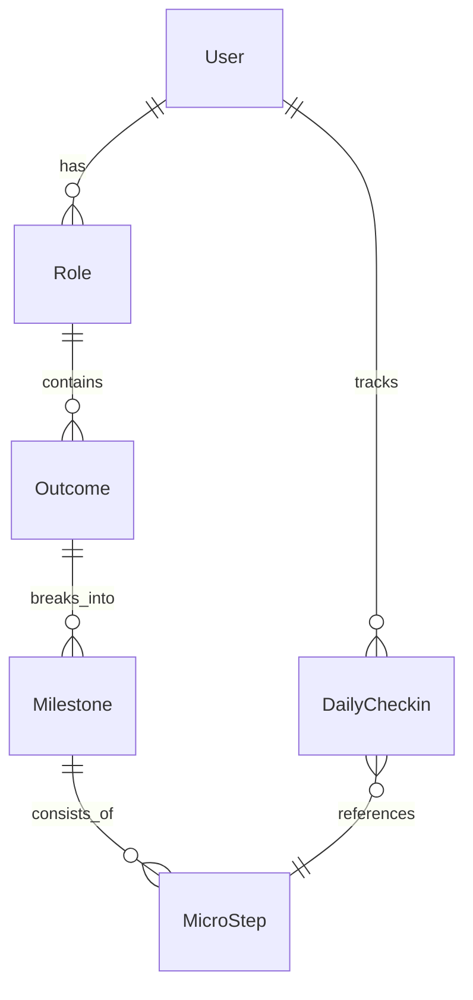

# Franklin App Architecture

## Overview

Franklin is a React Native mobile application built with Expo that helps users transform identity-level goals into daily micro-actions. The app follows a local-first architecture with offline support and cloud sync via Supabase.

## Tech Stack

### Frontend
- **React Native + Expo SDK 52**: Cross-platform mobile development
- **TypeScript**: Type safety throughout the codebase
- **NativeWind**: Tailwind CSS for React Native styling
- **Zustand**: Lightweight state management
- **React Query**: Server state management and caching
- **React Navigation**: Navigation framework

### Backend
- **Supabase**: PostgreSQL database with real-time subscriptions
- **Row-Level Security**: User data isolation
- **Edge Functions**: Serverless compute for integrations

### Infrastructure
- **GitHub Actions**: CI/CD pipeline
- **EAS Build**: Expo Application Services for building and deploying
- **Sentry**: Error tracking and performance monitoring
- **PostHog**: Product analytics

## Data Model

## Key Features

1. **Identity-Based Goal Setting**: Users define roles and 12-week outcomes
2. **Twice-Daily Check-ins**: Morning planning and evening reflection
3. **Automatic Progress Tracking**: Integration with health apps and calendars
4. **Offline-First**: Full functionality without internet connection
5. **Privacy by Default**: All data encrypted at rest and in transit

## Security Considerations

- HTTPS everywhere
- Row-level security in Supabase
- Encrypted local storage
- No tracking or analytics without consent
- OWASP Mobile Top 10 compliance

## Development Workflow

1. **Local Development**: `npm run dev`
2. **Testing**: Jest unit tests, Detox E2E tests
3. **Preview Builds**: Automatic QR codes on PRs
4. **Production Deployment**: Tag-based releases via GitHub Actions

## Monitoring & Analytics

- **Sentry**: Crash reports and performance metrics
- **PostHog**: User behavior and feature adoption
- **Supabase Dashboard**: Database metrics and usage

## Future Considerations

- AI-powered micro-step suggestions
- Social accountability features
- Web companion app
- Apple Watch / Wear OS apps